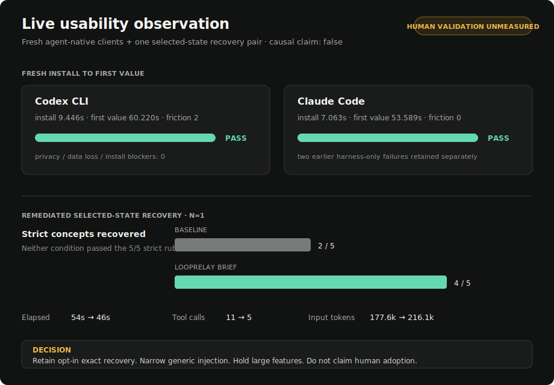

# Practical usability evaluation — 2026-07-12

This is a fresh, raw-free, agent-native usability check of the current local
LoopRelay runtime. It is not an independent-human study and does not establish
causality. Its preregistration is in
[`evaluation/usefulness/2026-07-12-live-usability-preregistration.md`](../evaluation/usefulness/2026-07-12-live-usability-preregistration.md);
the machine-readable observation is
[`reports/live-usability-2026-07-12.json`](../reports/live-usability-2026-07-12.json).

## What was actually exercised

The candidate package was built from `b7df1b5a` and checksum-pinned before the
client runs. Each client used a fresh agent session, isolated npm prefix,
isolated LoopRelay data, and a new Git repository. The agent had to discover
the loop command, create an in-progress checkpoint, and receive a continuation
brief. No prompt bodies, answer bodies, paths, credentials, or transcripts were
committed.

| Client | Install | First value | Friction | Result |
| --- | ---: | ---: | ---: | --- |
| Codex CLI 0.144.1 | 9.446s | 60.220s | 2 | Pass |
| Claude Code 2.1.207 | 7.063s | 53.589s | 0 | Pass |

Both successful runs had zero privacy, data-loss, and installation blockers.
These are agent-operator observations, not human usability completions.

Two earlier Claude harness attempts failed before the product received a prompt:
the variadic `--add-dir` option consumed the trailing prompt. Those attempts
remain in the raw-free report as harness friction. The harness now places the
prompt before `--add-dir`, runs Claude in safe mode, and classifies failures
without retaining their output. This is a measurement repair, not a product
success claim.

## Fresh recovery comparison

The remediation pair used two fresh, read-only Codex sessions on the same clean
repository commit. The baseline received only a generic request to resume. The
treatment received the same request plus a local explicit checkpoint containing
the measured client outcomes, the two excluded harness attempts, the
no-human-adoption boundary, and the intended scope decision. That checkpoint
was not in Git.

| Measure | Baseline | LoopRelay brief | Difference |
| --- | ---: | ---: | ---: |
| Strict concepts recovered | 2/5 | 4/5 | +2 |
| Strict pass | No | No | — |
| Elapsed time | 54s | 46s | -8s |
| Tool calls | 11 | 5 | -6 |
| Input tokens | 177,608 | 216,074 | +38,466 |

The treatment recovered both client timings, both friction counts, the two
invalid harness attempts, the no-human-adoption boundary, and the retain/narrow
scope decision. The baseline instead recovered the older release and human
validation backlog from repository files.

Neither condition passed the strict rubric. The treatment still framed the
repository release backlog as the immediate task instead of the current live
evaluation. The earlier non-remediation pair is also retained separately: its
checkpoint named the evaluation but did not contain the observations the rubric
asked the agent to recover, so it is `checkpoint_evidence_under_specified`
rather than evidence for or against product usefulness.

## Decision

**Retain, opt-in:** exact checkpoint and continuation-brief recovery when the
selected state is absent from Git. This is the only present feature with a
direct fresh recovery signal.

**Narrow:** generic continuation injection for routine implementation and
release work. Existing cohorts already show null, negative, or high-cost results
there; this run adds another example of a brief competing with repository-wide
backlog context.

**Hold:** large new features, autonomous model switching, and any broad
productivity claim. Independent human observations remain zero, and this single
new recovery pair is deliberately not pooled with the eleven-pair real-task
ledger.

The evidence UI now surfaces this scope at the top of the product-evidence
panel: explicit recovery is the supported use, generic injection is not the
default, and human validation is unmeasured. The UI does not turn any of these
observations into an automatic recommendation or a release-ready claim.
